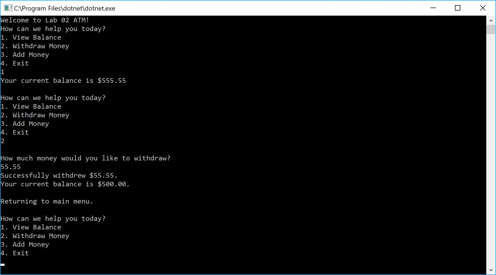

# Lab02-Unit-Testing
CODE: Unit Tests &amp; Documentation assignment for Codefellows 401 ASP.NET course

**Author**: Earl Jay Caoile  
**Version**: 1.0.0

## Overview
This application provides a demonstration of how unit testing works.

## Getting Started
The following is required to run the program.
1. Visual Studio 2017 
2. The .NET desktop development workload enabled
3. No External NuGet packages are required for this application. 

## Example

## Architecture
This application is created using ASP.NET Core 2.1 Console applicaitons.  
*Language*: C#  
*Type of Applicaiton*: Console Application  

## Change Log
01-01-2001 10:00am - Created initial scaffolding files.  
01-01-2001 11:00am - Main program functionality finished. 
01-01-2001 12:00pm - Test program created with all passing tests. 
01-01-2001 1:00pm - Added try, catch, finally, and throw. 

